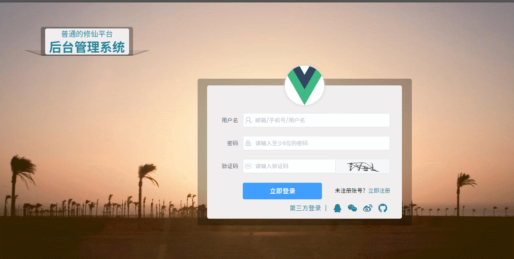
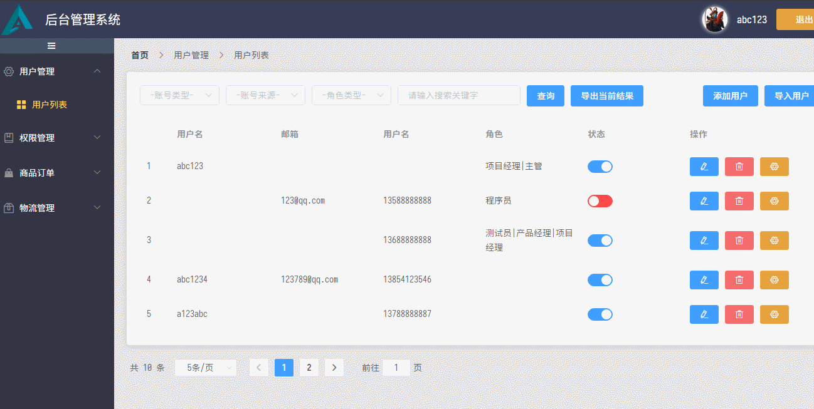
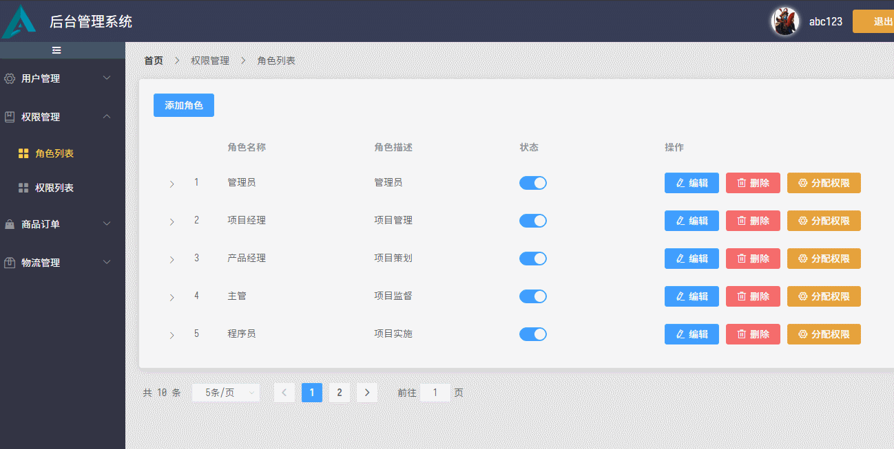
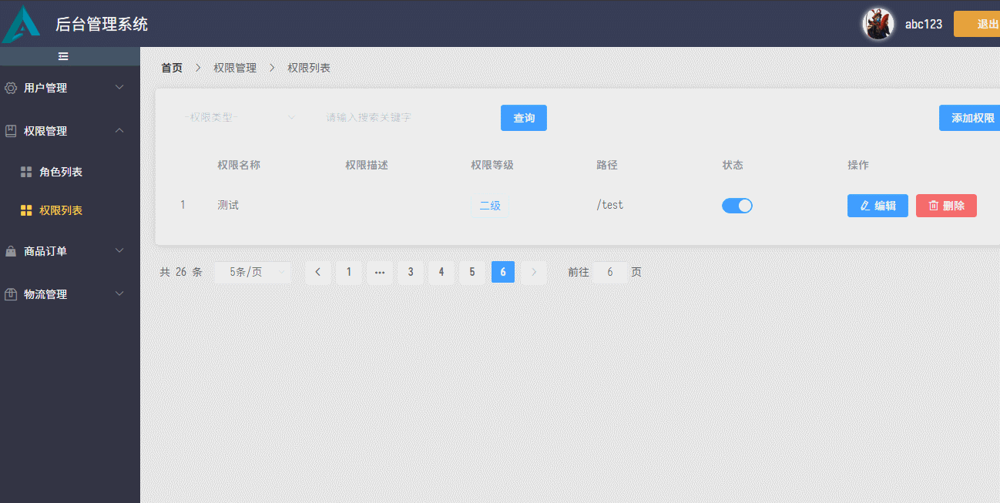

# Admin-Vue-Egg-TS
基于 Vue，Egg 开发的前后端分离的通用 Admin 系统

## 目录结构
+ backend-egg：egg-ts 开发的 Admin 后端项目
+ frontend-egg：vue-ts 开发的 Admin 前端项目

## 效果展示
### 注册 
### 登录 
### 搜索 
### 编辑 
### 增删 
### 角色 
### 权限 

## 拥有模块
+ [x] 注册登录
  - [x] 第三方登录
  - [x] 图形验证码
  - [x] 短信验证码
  - [x] 邮箱验证码

+ [x] 用户管理
  - [x] 用户信息增删改查
  - [x] excel 导入导出
  - [x] 角色分配

- [x] 权限管理(RBAC)
  - [x] 角色增删
  - [x] 权限展示与分配
  - [x] 权限增删改查(分级制)

- [x] 挖坑
  - [ ] 分类管理
  - [ ] 商品管理
  - [ ] 订单管理
  - [ ] echarts 统计
    

